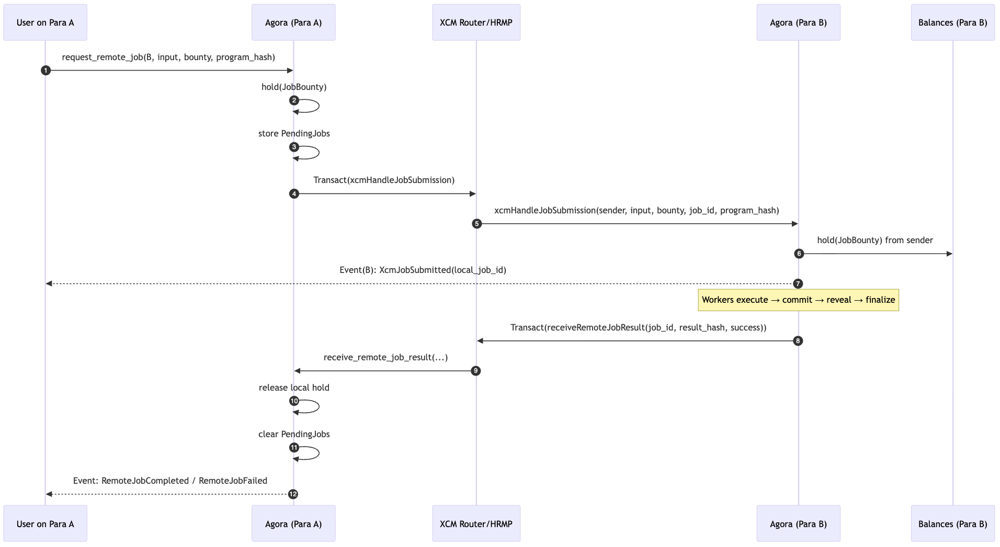

# Agora 
Verifiable Off‑Chain Computation via Commit‑Reveal and XCM

 

<p align="center">
  
</p>
 
 ## System Architecture


Agora is a Polkadot parachain template extended with a verifiable computation marketplace. It enables parachains to outsource off‑chain jobs (API fetches, computations) to a network of staked workers. Results are verified on‑chain using a crypto‑economic commit‑reveal game. Cross‑parachain requests and result delivery use XCM. This instance has been obtained with paraid 5024 on the Paseo test network.

### Why Agora
- Verifiable correctness without trusted hardware: commit–reveal with on‑chain verification ensures results are independently checkable.
- Decentralized worker marketplace: staked workers compete to execute jobs; dishonest actors are slashed, honest majority is rewarded.
- XCM‑native interoperability: submit from one parachain, execute on another, and receive results back seamlessly.
- Flexible execution off‑chain: leverage OCWs and external infrastructure for low‑latency IO and scalable compute.
- Deterministic on‑chain settlement: rewards, slashing, and consensus resolution are transparent and reproducible.

### Live Walkthough
[](https://app.supademo.com/embed/cm6xuj2sr01o8pegv3s411vap)


### App Workflow


#### XCM Flow (cross‑parachain request and result delivery)



## High‑Level Architecture

- Runtime (`runtime/`): FRAME‑based runtime with balances, collator pallets, XCM helpers, and the `agora` pallet. XCM is configured for local testing with permissive filters.
- Node (`node/`): Collator binary that runs the runtime, exposes RPC, and connects to the relay chain.
- Agora Pallet (`pallets/agora/`):
  - Job lifecycle: submit -> commit -> reveal -> finalize
  - Staking and bounty holds; rewards/slashing; simple reputation
  - Off‑Chain Worker (OCW) helpers for job execution and commit/reveal guidance
  - XCM client/handler for cross‑parachain job requests and result notifications
- Zombienet configs (`zombienet-*.toml`): Local networks with relay chain + 2 parachain instances for XCM demos.
- Scripts (`JS/`): Utilities to fund sovereign accounts, open HRMP channels, and run a cross‑chain job demo.

## Repository Layout

- `node/` – Collator service (AURA consensus, networking, RPC)
- `runtime/` – Runtime types, pallet composition, XCM config (`runtime/src/configs/xcm_config.rs`)
- `pallets/agora/` – Verifiable computation pallet
  - `lib.rs` – Storage, events, errors, extrinsics, hooks
  - `functions.rs` – Consensus, rewards/slashing, lifecycle processing
  - `ocw.rs` – Off‑chain worker execution helpers (simulated HTTP/compute), commit/reveal guidance
  - `xcm_job_client.rs` – Build/send XCM job requests, receive results
  - `xcm_handler.rs` – Handle incoming XCM job submissions, send results back
  - `types.rs` – Job, worker, commit/reveal, OCW types
- `zombienet-xcm.toml` – Relay + two parachains (IDs 1000, 2000) with XCM tracing enabled
- `JS/setup-hrmp.js` – HRMP channel setup, sovereign funding, and `agora.requestRemoteJob` demo

## Build

Prereqs: Rust toolchain (nightly as per `rust-toolchain.toml`), wasm32 target, Node.js (for scripts), and a `polkadot` relay binary.

```bash
# From repo root
 cargo build --release -p parachain-template-node --bin parachain-template-node

# Optional: install the collator binary somewhere on PATH
sudo cp target/release/parachain-template-node /usr/local/bin/

# Ensure a polkadot relay node is available on PATH (or provide absolute path in Zombienet)
sudo cp polkadot /usr/local/bin/polkadot
```

## Run: Local Multi‑Chain Network (Zombienet)

This repo includes `zombienet-xcm.toml` to boot a relay chain (rococo‑local) and two parachain instances for XCM testing.

```bash
# Example with zombienet (ensure you have it installed)
zombienet -p native spawn zombienet-xcm.toml
```

Key ports (from `zombienet-xcm.toml`):
- Relay RPC/ws: 9944/9988
- Para 1000 RPC/ws: 9946/9990
- Para 2000 RPC/ws: 9947/9991

## HRMP + XCM Demo

Use the provided Node.js script to fund sovereign accounts, open HRMP channels, and dispatch a cross‑chain job request.

```bash
pnpm i || npm i
node JS/setup-hrmp.js
```

The script performs:
- Funds sovereign accounts (relay and cross‑parachain)
- Opens HRMP channels 1000 ↔ 2000 using XCM `Transact`
- Debug.js to verify the status of the parachains.

## Agora Pallet – On‑Chain API

Extrinsics (selected):
- `agora.submitJob(job_type_id, input_data, bounty)` – Submit a local job with a bounty hold
- `agora.registerWorker(stake)` / `agora.unregisterWorker()` – Worker enrollment with staking
- `agora.commitResult(job_id, salt, result_hash)` – Commit phase
- `agora.revealResult(job_id, result)` – Reveal phase; pallet verifies salted hash
- `agora.finalizeJob(job_id)` – Finalizes by consensus (auto‑finalization also runs in `on_initialize`)
- `agora.requestRemoteJob(dest_para_id, input_data, bounty, program_hash)` – Send cross‑para job via XCM

Events include job submission, commits/reveals, finalization, rewards/slashing, and XCM‑related notifications.

Storage highlights:
- `Jobs`, `Workers`, `Commits`, `Reveals`, `Results`, `PendingJobs`, `RemoteJobInfo`, `NextJobId`, `JobNonce`.

Consensus and rewards:
- Majority of reveals determine the canonical result.
- Honest workers split the bounty; dishonest workers lose reputation and have stake reduced.

## Off‑Chain Worker (OCW)

- Scans for pending jobs and simulates execution for:
  - API requests: returns simulated payloads (upgradeable to real HTTP with proper signing/validation)
  - Computation jobs: hash/math/crypto/json toy tasks
- Generates salted commits and logs ready‑to‑submit `commitResult`/`revealResult` transactions.
- Automation of signed extrinsic submission can be enabled in future work.

## Configuration and Parameters

Runtime (`runtime/src/lib.rs`) sets:
- Block time: 6s; weight/fee mapping
- `Agora` constants: `MinWorkerStake`, `MinJobBounty`, commit/reveal durations, limits
- XCM router: Parent UMP + XCMP; permissive `Barrier` and `Everything` filters for local testing

Harden for production:
- Restrict XCM execute/send filters; require paid execution with proper fee trading
- Tighten `LocationToAccountId` conversions and origins
- Replace simulated OCW HTTP with a secure, signed, and verifiable approach
